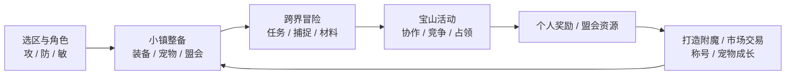

# 《轮回online》手机 3D MMO 原型设计

版本：0.2 | 日期：2026-09-05 | 状态：设计提案，尚未制作 Unity 可执行原型

## 1. 产品定位

一个角色游历多个世界，靠装备与宠物形成自己的打法，与盟友争夺各有玩法的宝山，再将收获投入成长、交易和盟会建设。

用户已确定：名称《轮回online》；Unity 完全重制；手机原生安装游玩；画面精美；以用户提供的轮回玩法说明为主要参考，旧页面和现有项目仅供参考。

设计基准：横屏、双拇指、第三人称、Android/iOS 原生客户端。首轮优先 Android 真机验证，PC 只作编辑器和调试工具。采用移动、选定目标与即时技能相结合的轻动作玩法，避免对手机精准瞄准和极短反应窗口的过度要求。

核心价值依次为：攻防敏的职业博弈、装备与宠物成长、跨场景探索、宝山盟会竞争、玩家经济。四人共斗是其中的重要组成，不替代整套轮回玩法。

## 2. 原版依据与重制边界

用户说明是主要依据；`lunhui/scenes83/site` 补充地点、任务、界面与状态表达。下文将“原版参考”与“重制提案”分开：新机制、数值、时长、场景构图均需试玩验证，不代表还原了原算法或已经实现。

资料中的腾讯网入口、QQ 登录和“最新烛龙区”作为历史背景，不认定为当前运营状态。新游戏从 App 登录、选区、取昵称和选职业进入；正式 QQ 登录需独立接入开放平台，不能凭输入 QQ 号完成认证。

| 原版乐趣 | 保留的结构 | 重制重点 |
| --- | --- | --- |
| 攻、防、敏差异 | 三职业名称，基础攻防与附攻附防 | 技能职责、属性解释、可观察的战斗结果 |
| 等级开放场景 | 探险、海盗、机战、三国、龙珠 | 同一角色穿梭，环境和活动有明显变化 |
| 装备与宠物长线成长 | 打造、加品、鬼炉、附魔、进化、转生、魂魄鼎 | 看得见的成果、清楚的投入与风险 |
| 六宝山不同玩法 | 答题、迷宫、护法、争夺、屠龙、寻宝 | 3D 空间表达，手机短局参与 |
| 盟会、称号与交易 | 贡献、建设、荣誉、占领奖励、市场 | 合作收益、可追溯分配、避免长期垄断成长 |

原网页 99 个抓取入口加索引共 100 个 HTML，不等于 99 张地图。页面快照中有重复和未抓取动作，不能直接推定完整规则。原站没有可直接复用的 3D 资产。

## 3. 核心循环与手机节奏



一次上线可以只完成一段：3 至 5 分钟整理装备或交易，5 至 8 分钟完成野外事件或一轮宝山贡献，8 至 12 分钟打一局四人遗迹。时间是节奏目标，不是强制退出计时器。

大型盟会目标允许多轮短局累积贡献。藏宝山原版约 30 分钟的争夺，可保留为正式活动窗口，但每位玩家通过 5 至 8 分钟的一轮参战产生有效贡献；具体轮数、匹配与积分权重另做赛制测试。

普通任务支持路线标记和可取消的自动寻路，接敌后可持续普攻。危险技能、宝山机关、灵宠指令与配装需要玩家判断。原型不让全自动操作替代玩法验证。

重玩理由应能具体说出：“换一条迷宫路线”“换一只宝宝配合盟友”“验证一套附攻装备”“为盟会赢下另一座山”。账号成长、装备、好友不会因一局结束而清空。

## 4. 三职业

| 职业 | 外观与武器提案 | 两个原型技能 | 独特乐趣 | 弱点 |
| --- | --- | --- | --- | --- |
| 无坚不摧（攻） | 利落战甲、长刃 | 破阵斩：扇形破防；蓄势：下次攻击强化 | 在对手失误或队友控制后爆发 | 防护较弱，蓄势有明确前摇 |
| 金刚护体（防） | 厚重护甲、盾与短兵 | 护心阵：范围减伤；反震：吸收后释放冲击 | 护住队友，守点，承压后反击 | 追击有限，离开阵地后保护效率降低 |
| 行动敏捷（敏） | 轻甲、双刃 | 掠影：短位移；破绽：提高附加伤害发挥 | 选择进退时机，围绕附攻附防与暴击搭配 | 基础攻防偏低，位移和增益结束后有窗口 |

每职业首轮只实现普攻、两个职业技能、公共闪避和一个宠物指令。共享标准骨架，服饰、武器和动作区分；不制作完整职业树。职业影响成长与职责，不能通过随意换武器绕过职业选择。

### 敏捷与附加属性

保留“敏捷影响附攻、附防发挥，并影响暴击”的特色。说明和页面没有给出完整公式，因此新公式属于平衡设计，不能声称已还原原版。

候选方案：敏捷以递减收益影响附加属性发挥和暴击概率，并设置可配置上限；基础攻击、防御继续有独立价值。面板分别显示基础攻防、附攻附防、敏捷、暴击概率和减伤来源。

敏捷应有独特构筑空间，但不能同时拥有最高输出、最高减伤和无限闪避。“敏克攻”视为可形成的玩家策略，不写成必胜关系。防要有抗爆发与守点空间，攻要有明确破防机会。

建立同等级、同装备预算的职业互测，记录对局胜率、平均战斗时间、爆发伤害与操作水平。等装 PvP 与成长型 PvP 分开验证，避免把装备差距误认为职业特色。

## 5. 五大场景

| 世界 | 视觉提案 | 主要玩法 | 长期收获 |
| --- | --- | --- | --- |
| 探险 | 极北雪山、隔世小镇、湿地、古老机关 | 主线、基础捕捉、宝山与迷宫 | 学会职业、宠物、组队与市场 |
| 海盗 | 港口、帆船、岛屿、海雾和风暴 | 宝图碎片、登船事件、海盗宝山 | 航海材料、水域宠物 |
| 机战 | 遗落机械城、能源核心、金属与植被 | 能源路线、机械首领、协作解锁 | 模块材料、机械伙伴 |
| 三国 | 城关、军营、旌旗与山道 | 军需护送、据点、战阵任务 | 盟会资源、兵器外观 |
| 龙珠 | 天空岛、气脉、高山与试炼塔 | 线索收集、气脉挑战、强敌试炼 | 进阶宠物、高阶养成材料 |

人物骨架、装备槽、宠物指令、UI 与经济统一；不同世界重点改变地形、敌人行为和活动，不再各造一套独立游戏。

五场景的准确等级门槛未在用户资料中给出，作为 `worldUnlockLevel` 配置等待进度测试，不沿用现有项目的假定数值。未开放世界可预览解锁要求和主题。

完整产品保留五世界方向，首轮只制作探险可玩片区。其他世界提供设计规格与入口预览，不冒充已完成关卡。“龙珠”相关角色与资产在内容定稿时确认使用范围，原型先用原创气脉试炼素材。

## 6. 六宝山

| 宝山 | 原版参考 | 手机 3D 重制提案 | 收益方向 |
| --- | --- | --- | --- |
| 智宝山 | 连续答题，累计盟会分数争夺，连占可能增加题量 | 题碑与分岔门，讨论或独立选择，按有效答题计分 | 个人奖励、盟会积分、有限额采集 |
| 文宝山 | 迷宫、求神问路、走若干步抵达 | 立体迷宫、壁画线索、宠物提示、岔路标记 | 打造材料、探索评分、盟会积分 |
| 珍宝山 | 挑战护法和他盟玩家，获得荣誉 | 自愿参与的护法据点战，先验证受控 4 对 4 | 荣誉、个人贡献、据点积分 |
| 藏宝山 | 攻守、约 30 分钟守山、集市收税权 | 活动窗口内多轮短局，据点与守护神共同计分 | 占领展示、有上限的税收分成 |
| 龙宝山 | 盟会屠龙积分决定挖山资格 | 协作首领，部位破坏、救援、完成机制都有贡献 | 屠龙积分、材料、限额挖山 |
| 海盗宝山 | 宝图碎片与铁铲换取宝藏和积分 | 组图、选海岛路线、机关与遭遇交替 | 宝藏、图鉴、盟会积分 |

### 首轮可玩样板：文宝山

文宝山能同时验证三职业、宝宝、探索、四人合作和盟会收益，适合作为第一张系统完整的关卡。

一局约 8 至 12 分钟：“入口线索 → 两条岔路 → 机关前庭 → 山门守卫 → 个人奖励与盟会积分”。首版固定两套可复现路线，之后再加入随机组合。

安全路线提供恢复资源，挑战路线包含精英并增加打造材料。队伍在入口共同确认路线，没有必选职业或宠物。求神问路成为有限次数提示，使用后减少探索评分奖励，但保留基础通关奖励。走错能回头，不能把陌生队友永久锁在外面。

山门守卫为新增机制：标记一位玩家，攻击方向跟随其移动，再明确锁定。被标记者把冲击引向阵柱，锁定后离开危险线，队友趁守卫失衡攻击。防可护队友，攻抓弱点，敏调位，但任何职业组合都可通关。

前摇初值不短于约 1.2 秒；标记跟随约 2 秒、锁定后再等待约 1.5 秒。失败只延长战斗，下一轮可重试；阵柱在对应阶段才激活，不能提前破坏导致卡关。单人教学也可完成，正式多人验收必须四台真实手机。

倒地后队友持续交互约 3 秒可救援，受击会打断；每次尝试全队两次成功救援，取消不扣次数。倒地 30 秒未救起则旁观，全员失去战斗能力就重置。团灭重试恢复补给，无碎装和掉落惩罚。上述数值全部可调。

文宝山断线后由服务器继续模拟，5 秒后角色离场且不能行动或贡献，席位保留至断线起 60 秒。重连恢复已确认状态，不补药、不重置冷却；战斗中不加入新玩家。若全员离场则重置尝试。珍宝山对抗采用独立掉线裁定，不能通过切后台获得无敌收益。

### 计分与公平

个人任务和个人掉落独立结算，不抢最后一击。盟会积分按实际参与贡献记录；输出、有效承伤、实际治疗、解谜、救援都可贡献，不能只用伤害榜评价防职业。站桩、刷自造损伤和关联小号互刷不产生无限贡献。

占领收益设置周期、上限和重赛机会。藏宝山税率由系统设定，盟会分享部分税收，不能任意提高所有玩家成本。税收不直接转成无限职业属性，避免长期统治造成成长垄断。

## 7. 装备系统

| 系统 | 用户提供的原版参考 | 需要补全的规则 |
| --- | --- | --- |
| 加品 | 35 级后开放；材料提升空间约 20 级，初始 +1 示例可到 +21；鬼炉最高 30 品 | 各档概率、消耗、基础品质与上限关系 |
| 打造 | 42 级首套，二转 90 可打造顶装 | 部位、配方、产出曲线 |
| 附魔 | 65 级开放，最高魔 10；材料可到魔 6，更高使用荣誉/声望；资料也提及魔 4 后可用声望 | 精确条件、概率、消耗与作用属性 |
| 效果 | 魔 10 描述为提升到 300% | “变为 300%”或“增加 300%”不同，基数未确定 |
| 风险 | 荣誉/声望方式失败可能减 2 级魔 | 适用等级、保护与保底 |
| 直接附魔 | 活动获取对应等级道具，参考价格 99 玩币一次 | 旧版来源，不代表重制已确定付费抽取 |

### 重制体验

四条路径职责区分：打造确定基础装备；加品改善基础性能；鬼炉突破品质阶段；附魔强化指定属性或形成配装方向。页面展示外观、来源和可成长空间，让装备具有记忆点。

操作前显示消耗、作用属性、前后差值、成功率和失败后果，再一次确认。材料不足可查看获取途径；请求中锁定提交，服务端保障重试不重复扣料或发放。

优先试玩“失败累计进度、关键等级保护”的提案，再与旧版降级风险做对照。这是建议，不是已确认最终平衡。直接附魔道具先通过高难活动获得；原型不接真实充值和付费抽奖。

35/42/65、二转 90 作为原版门槛存入参考配置，正式进度等待测试。原型另设明确标识的“65 级系统测试角色”，直接演示打造、加品、附魔；与新手存档、正式经济和排行榜隔离，不能靠几分钟升到 65 级伪造完整成长。

## 8. 宠物、盟会与称号

### 宠物

来源保留四类方向：25 级领养、战斗捕捉、长期社交关系相关获得、箱子或活动获得。婚姻/后代不在首轮实现，先保留规格。稀有获取方式需要新产出表，不能直接搬旧付费价格。

新手前 5 分钟可借用情花提供的教学伙伴；25 级再解锁永久领养。临时伙伴不能培养或交易，完成教学后归还或继续作为无养成的剧情跟随者。这是重制教学提案，不是旧版一级领养规则。

第一批仅做破势型与护佑型两只伙伴，砾灵/灯灵可作为原创美术提案。一只出战，自动跟随和基础协攻，关键技能手动下令；两种探索用途均有替代路线，不因宠物重复卡队伍。

保留资质、进化、转生、魂魄鼎：潜力、形态与能力变化、新成长阶段、长期资源投入各司其职。公式、转生继承与重置范围待设计；旧资料初始资质 135 不是重制最高值。捕捉要有可捕捉标识、状态、消耗和结果反馈。

### 盟会

贡献认可参与和捐赠；建设用于公共设施；荣誉来自对抗或高难挑战。三类账户的来源、用途、分配记录可查。原版创建资金 500 万作参考，重制门槛根据金币产出确定。

原型使用测试盟会，包含成员、公告、活动入口和贡献记录。设施优先提供公共配方、备战或展示价值，谨慎叠加永久属性。外交、完整权限和公会建筑暂缓。

### 称号

保留声望、威望、荣誉三类方向：攻击/内力、生命/防御、附攻/附防/敏捷。每类先做一个示例，显示获取条件与实际效果。

建议把外观展示称号与实际属性称号分开选择，并限制同时生效的属性组。90/100/120 级称号与玩币购买属于原版参考，不直接作为原型付费或无限叠加方案。

## 9. 手机界面与操作

入口：App → 必要资源检查 → 登录 → 选区 → 选角或昵称/三职业 → 情花引导 → 探险世界。首轮使用受控测试账号，正式外部登录独立接入。

```text
┌────────────────────────────────────────────────────────────┐
│ 头像/生命/内力       目标生命/蓄力          小地图/世界名       │
│ 队伍简栏                                    任务摘要        │
│                                                            │
│                  全屏第三人称 3D 世界                        │
│              角色、宠物、敌人预警与机关地标                    │
│                                                            │
│                                                技能二       │
│      左摇杆                            宠物    普攻   技能一  │
│ 聊天折叠/队伍                           交互    闪避           │
└────────────────────────────────────────────────────────────┘
```

左侧浮动/固定摇杆可切换；右侧空白区拖动镜头。普攻长按持续攻击；技能轻点朝当前目标释放，拖动可调整方向并取消。软锁定优先前方可见近敌，点敌人切换；镜头拖动和技能触控区明确分开。

大普攻键目标约 64 dp，其他常用触控目标至少 48 dp、间隔至少 8 dp。正文初值至少 14 sp，核心数字至少 16 sp，均用真机 DPI 与可读性校验，不能当作 Unity 世界单位。

技能区位置固定，交互/采集/救援仅按上下文出现且不推挤技能。聊天默认折叠，任务最多两行，进入宝山替换为活动目标。刘海、圆角、手势条和系统返回均纳入安全区。

| 关键界面 | 原型操作 | 必要异常状态 |
| --- | --- | --- |
| 三职业选择 | 旋转角色、看差异、试招、确认职业 | 返回、昵称冲突、创建失败 |
| 神匠/装备 | 对比、选材料、预览和确认加品/附魔 | 不足、失败、请求中、已结算待恢复 |
| 宝山大厅 | 六山玩法、个人/盟会进度、报名与准备 | 未开放、准备中、结算中；未制作项标明范围 |
| 文宝山 | 路线确认、标记、机关、守卫、救援 | 走错、提示次数、倒地、团灭、重连 |
| 宠物 | 领养/捕捉、出战、资质、进化预览 | 临时伙伴、无宠物、冷却、材料不足 |
| 盟会/市场 | 成员、贡献；固定价买卖、撤单、到账 | 未加入、权限不足、售罄、余额不足、背包满 |

打开面板不暂停多人世界，阻止穿透点击。Android 返回先关面板，再确认退出。切后台、锁屏、电话和网络切换有恢复状态；不会把后台状态当作服务器暂停。

设置提供布局位置、按钮大小、镜头灵敏度、震动、音量、画质与帧率。游戏界面不展示键鼠快捷键，不默认要求外接设备。

## 10. 首轮试玩

### 新手体验：15 至 20 分钟，可分段

| 节奏 | 玩家行动 | 验证 |
| --- | --- | --- |
| 0 至 3 分钟 | 取名选职业，情花带领走过小镇石桥，释放技能 | 原生流程、角色魅力、触控自然 |
| 3 至 6 分钟 | 借用伙伴，完成遭遇与交互 | 宠物存在感、预警、目标选择 |
| 6 至 8 分钟 | 获得材料，查看神匠与宝山，组队 | 成长目标与合作动机 |
| 8 至 18 分钟 | 文宝山教学试炼：选路、机关、守卫 | 职业配合、发现、失败学习 |
| 18 至 20 分钟 | 个人收获、测试盟会积分、回镇整备 | 是否愿意换路线或职业再来 |

教学试炼是新增的新手版本，正式宝山开放门槛和奖励资格独立配置。时间不包括所有失败与等人，记录真实耗时。

### 高等级系统演示

独立 65 级测试角色配等预算攻防敏装备、测试材料和永久宠物，走通“打造 → 加品 → 附魔结算 → 属性对比 → 文宝山 → 盟会积分 → 集市”。调试发放不记作真实获得，不接正式经济。

## 11. 画面精美的标准

高品质风格化写实，人物约 6.5 至 7 头身；衣料、金属、玉石与石材分明。小镇以青瓦、朱红幡旗、白石、绿色植被和清澈水面构图，局部暖灯。避免整屏蓝紫光效、过曝 Bloom 或用浓雾掩盖场景。

探索镜头角色约占画面高度 20% 至 25%，看得清服装和伙伴；首领战适度拉远。地面预警通过形状、边缘和音效提示，不只靠颜色。降低友方特效时仍保留敌方危险信号。

### 精制场景样板

制作“石桥 → 传送门楼 → 神匠广场”约 60 米可行走路径：精制人物、宠物、NPC、水面、树、旗帜和工坊。验收桥头、广场、角色近景、背光、跑动转镜头与四人技能同屏。

样板需要真机画面和性能记录。概念图、界面示意与编辑器截图均不等于手机实机画质。灰盒只验证规则，不作为最终美术方向。

### 移动制作管线

Unity URP；静态建筑烘焙光照与反射探针，角色保留主光阴影；水面先使用法线、岸线和探针反射，不以实时平面反射/全屏反射为中档机默认。

概念设定 → 建模与拓扑 → UV/PBR → 绑定动画 → LOD/简化碰撞 → Unity 灯光 → 真机评审 → Addressables 分组。FBX 为主模型交换格式，glTF 需验证导入插件后使用。生成图片不等于获得可用的骨骼角色。

统一材质、纹理压缩、植被实例化、遮挡剔除和分区加载。高档机提升分辨率、阴影和效果密度；中档机减少背景成本，保留角色轮廓和交互清晰度。

| 真机档位起点 | 目标，尚未实测 |
| --- | --- |
| Android：骁龙 778G 级、6 GB | 中画质 30 fps，持续运行 p95 帧时间不超过约 40 ms |
| Android：骁龙 8 Gen 2 级、8 GB | 高画质可选 60 fps，p95 帧时间不超过约 20 ms |
| iOS：iPhone 13 级起测 | 默认 30 fps，热量与内存验证后再开放对应 60 fps 档位 |

至少运行 30 分钟，记录机型、OS、室温、画质、帧时间、发热、内存、电量和是否持续降频。暂定峰值内存 Android 1.5 GB、iOS 1.2 GB，需根据系统压力测试调整。

暂定基础安装下载约 250 MB 内、首区必要下载约 150 MB 内，首次可玩下载合计约 400 MB；压缩下载量、安装占用和缓存分别记录。其他世界按需下载，大资源下载尊重移动网络设置。均为预算起点，不是交付测量值。

## 12. 制作阶段

| 阶段 | 必须交付 | 验收 |
| --- | --- | --- |
| P0 手机手感 | Android 包、摇杆镜头、三职业各普攻/两技能、基础敌人、宠物指令 | 真机新玩家能操作，三职业差异可辨 |
| V0 画面，与 P0 并行 | 60 米精制小镇路径、角色宠物、移动光照材质 | 多机位和跑动中质量一致，达到设备预算 |
| P1 四人文宝山 | 四台真实手机、两路线、机关、山门守卫、个人结算 | 合作、团灭重试和恢复通过，少于四台不算通过 |
| P2 养成与盟会 | 新手试炼、独立 65 级测试角色、打造/加品/附魔、宠物、盟会积分 | 结算正确、投入收益可解释；共享区先 8 人再测 16 人 |
| P3 交易与对抗 | 固定价材料市场、珍宝山受控 4 对 4 | 账目守恒、职业互测；八人用真实设备验证 |

之后再扩充其余宝山、五世界内容、转生、高级宠物和正式经济。未实现项目只显示设计范围，不用可见入口冒充完成。

暂缓：无缝开放世界、百人同屏、全五世界美术、完整婚恋后代、公会外交/建筑、所有高阶称号、付费、全服复杂竞价。原型人数不是正式 MMO 容量承诺；团队预算未知，按验收推进，不承诺固定周数。

## 13. 试玩判断

招募 8 至 12 位未参与制作的玩家，包含部分原版玩家，至少两组四人，使用真实手机。以下是迭代门槛，不是已取得结果或商业留存预测。

- 操作：至少 75% 在 5 分钟内独立完成遭遇；记录技能误触、镜头误拖和手指遮挡。
- 职业：能说出攻防敏作用；等装测试没有一种同时支配生存、爆发和持续输出。
- 宝山：至少 75% 在第二次尝试能处理守卫标记；主动出现讨论、标记或救援。
- 养成：至少 75% 理解附魔投入、结果和风险，能区分基础与附加属性。
- 重玩：至少一半愿意换路线、职业或宠物再玩；询问具体原因。
- 手机体验：四人持续运行 30 分钟，验证发热、帧时间、触控疲劳、前后台切换与奖励恢复。

手感失败先改镜头/触控，职业失败改职责/收益，宝山失败改机制可读性/团队目标，画面失败改样板与资源预算。每轮先解决主要问题，再扩内容。

## 14. 交付边界

本次交付是设计规格和交互示意，没有安装 Unity、制作 APK/IPA 或声称达到真机性能。技术、原生打包、协议和实时服务见 [UNITY_IMPLEMENTATION.md](UNITY_IMPLEMENTATION.md)。交互示意已检查结构、文档链接和控件切换逻辑；当前无可用的连接浏览器，未完成浏览器截图验收，不能据此认定布局或美术已经通过真机评审。

参考：[场景索引](../../lunhui/scenes83/site/index.html)、[主界面](../../lunhui/scenes83/site/03_game_main.html)、[任务](../../lunhui/scenes83/site/main_任务.html)、[角色状态](../../lunhui/scenes83/site/main_状态.html)、[宠物](../../lunhui/scenes83/site/main_宝宝.html)、[神匠](../../lunhui/scenes83/site/main_神匠.html)、[鬼炉](../../lunhui/scenes83/site/main_鬼炉.html)、[拍卖](../../lunhui/scenes83/site/main_拍卖.html)。
